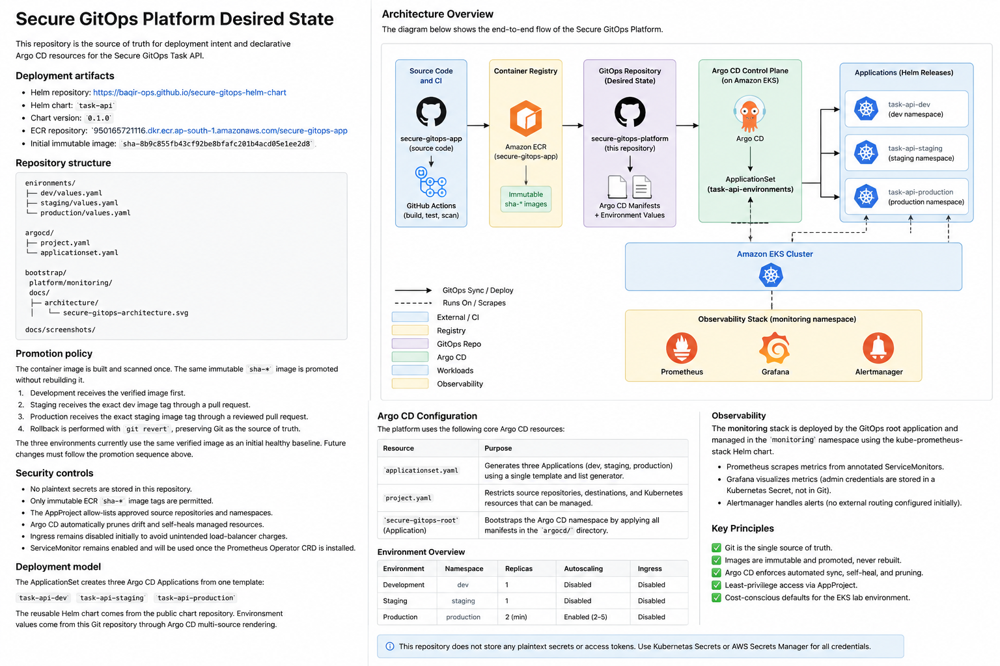

# Secure GitOps Platform Desired State

This repository is the source of truth for deployment intent and declarative
Argo CD resources for the Secure GitOps Task API.

## Architecture Overview

The Secure GitOps Platform separates application source code, container
image delivery, GitOps desired state, Argo CD reconciliation, Kubernetes
workloads, and observability.



## Deployment artifacts

- Helm repository: https://baqir-ops.github.io/secure-gitops-helm-chart
- Helm chart: `task-api`
- Chart version: `0.1.0`
- ECR repository: `950165721116.dkr.ecr.ap-south-1.amazonaws.com/secure-gitops-app`
- Initial immutable image: `sha-8b9c855fb43cf92be8bfafc201b4acd05e1ee2d8`

## Repository structure

```text
environments/
├── dev/values.yaml
├── staging/values.yaml
└── production/values.yaml

argocd/
├── project.yaml
└── applicationset.yaml

bootstrap/
platform/monitoring/
docs/screenshots/
```

## Promotion policy

The container image is built and scanned once. The same immutable `sha-*`
image is promoted without rebuilding it.

1. Development receives the verified image first.
2. Staging receives the exact dev image tag through a pull request.
3. Production receives the exact staging image tag through a reviewed pull request.
4. Rollback is performed with `git revert`, preserving Git as the source of truth.

The three environments currently use the same verified image as an initial
healthy baseline. Future changes must follow the promotion sequence above.

## Security controls

- No plaintext secrets are stored in this repository.
- Only immutable ECR `sha-*` image tags are permitted.
- The AppProject allow-lists approved source repositories and namespaces.
- Argo CD automatically prunes drift and self-heals managed resources.
- Ingress remains disabled to avoid unintended load-balancer charges in this lab environment.
- ServiceMonitors are deployed for `task-api` across dev, staging, and production,
  scraped by the kube-prometheus-stack (Prometheus, Grafana, Alertmanager) in the
  `monitoring` namespace.

## Deployment model

The ApplicationSet creates three Argo CD Applications from one template:

- `task-api-dev`
- `task-api-staging`
- `task-api-production`

The reusable Helm chart comes from the public chart repository. Environment
values come from this Git repository through Argo CD multi-source rendering.
---

## Final Platform Verification — Phase 17

The final platform verification confirms the operational state of the Secure
GitOps Platform after completing GitOps deployment, observability, alerting,
security validation, and recovery work.

Final verification covered:

- Argo CD applications synchronized and healthy
- Task API workloads running across dev, staging, and production
- Production HPA configured for 2–5 replicas
- Prometheus, Grafana, and Alertmanager running
- Task API PrometheusRule and ServiceMonitors present
- EKS worker node in `Ready` state
- Final platform architecture documented

### Final Evidence

See the complete evidence report:

[Phase 17 — Final Platform Verification](docs/evidence/phase-17-final-platform.md)

Final platform screenshots:

- [Argo CD applications healthy](docs/screenshots/phase-17-final-platform/01-argocd-all-applications-healthy.png)
- [Kubernetes workloads healthy](docs/screenshots/phase-17-final-platform/02-kubernetes-workloads-healthy.png)
- [Production HPA](docs/screenshots/phase-17-final-platform/03-production-hpa.png)
- [Monitoring, alerts and ServiceMonitors](docs/screenshots/phase-17-final-platform/04-monitoring-alerts-and-servicemonitors.png)
- [EKS node ready](docs/screenshots/phase-17-final-platform/05-eks-node-ready.png)
- [Secure GitOps architecture](docs/screenshots/phase-17-final-platform/06-secure-gitops-architecture.png)

> **Note:** `TaskApiDown` remains a documented gap between the target
> alerting design and the currently implemented alerting configuration.
